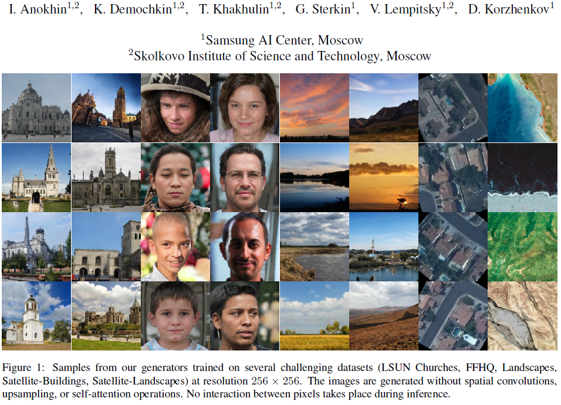
생성 난이도가 높은 데이터셋에 대한 256x256 해상도의 결과물, StyleGAN2 결과물과 유사한 수준을 보였다고 한다.

CIPS의 궁극적인 목표는 각 픽셀을 독립적으로 생성하는 모델을 만드는 것이다.

그를 위해서 Conv를 사용하지 않는 것이 필수적이며, 그럼에도 고품질의 이미지를 얻기 위해 Positional Encoding을 추가하여 SoTA를 달성하였다는 것으로 요약할 수 있겠다.

Paper: https://arxiv.org/abs/2011.13775

Github: https://github.com/saic-mdal/CIPS

## Introduction
CIPS는 Spatial Convolution이나 Self Attention 없이 MLP를 사용해 이미지를 생성하는 모델이다.

일반적인 생성 모델이 Spatial Convolution을 사용한 방법을 제시하고 있음을 생각하면 Convolution 없이 SoTA를 달성하는 것은 생각할 수 없었지만 CIPS는 LSUN Church 등에서 SoTA를 달성했으며 CVPR 2021에서 Oral 발표했다.

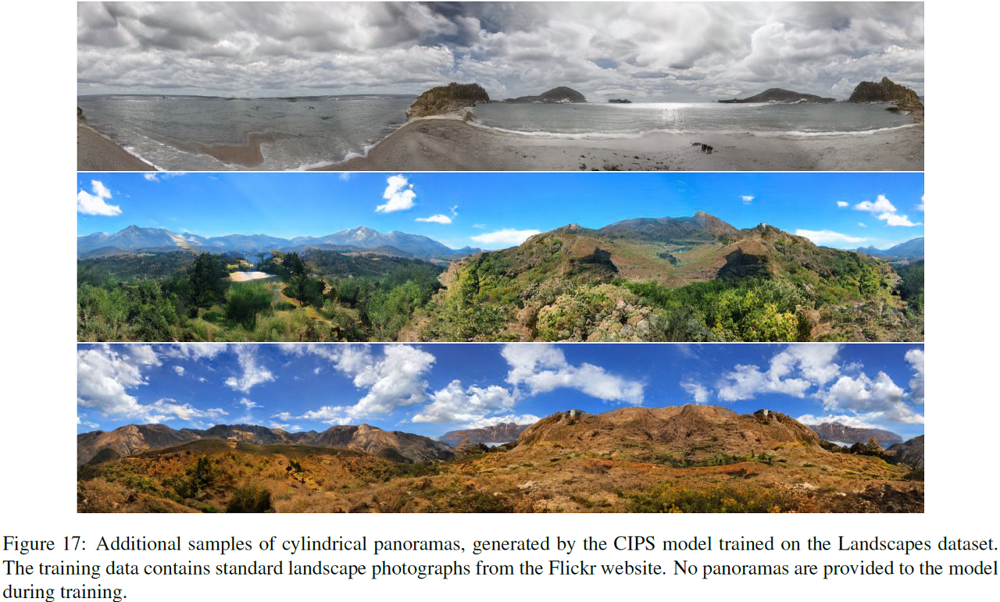

CIPS는 공간적 제약을 가지는 Spatial Convolution을 사용하지 않는 대신, 픽셀의 좌표값을 입력받아 각 픽셀을 독립적으로 생성하는 모델이다.

픽셀의 좌표를 추가로 입력받는 것은 CoordConv에서 Spatial-Relational Bias를 사용하는 데에 적용됐지만 CoordConv는 여전히 Spatial Convolution을 사용하고 있고 주변의 픽셀 정보를 알 수밖에 없기 때문에 종속적이라는 점에서 차이가 있다.

각 픽셀이 독립적이라는 것은 많은 장점을 가지고 있는데 예를 들어 원통형 파노라마 같은 이미지를 생성하는 등의 확장성을 갖고 있고, 메모리가 제한된 하드웨어에서도 순차적 합성을 통해 무리 없이 이미지를 생성할 수 있다.

위 Figure 에서 이미지를 가로로 1/4, 3/4 지점을 보면 상당히 좌우대칭으로 보이긴 하지만 고해상도 이미지를 만드는 데에도 많은 연구를 진행 중인 만큼 주목할만한 결과물이다.

## Method
그렇다면 픽셀의 좌표를 입력하기 위해서는 어떤 방법이 좋을까?

최근의 NeRF를 보면 MLP의 입력으로 이미지 픽셀 좌표를 인코딩 하는데에 Fourier feature를 사용한다.

높은 정확도를 가지는 결과물을 보면 Fourier feature를 쓰는 것이 효과적이라는 것을 알 수 있다.

그런데 이 Fourier feature를 이미지 생성 분야에 적용한 사례가 없었으며 CIPS가 그것을 적용한 사례로 보면 되겠다.

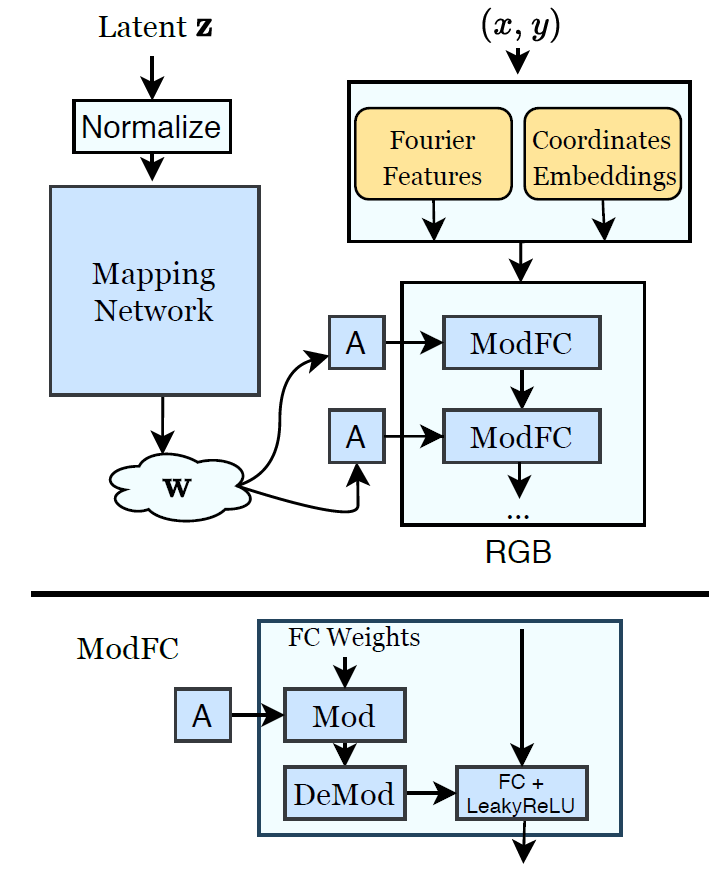

CIPS Generator 구조, 픽셀 좌표 (x, y)가 인코딩 되고 Weight Modulated MLP로 이미지를 생성한다. 이미지에는 빠져있지만, Skip Connection도 존재한다.
Generator는 HxW의 정해진 크기의 이미지를 생성하는데, 각 좌표에 대해 하나의 픽셀 값을 Regression 한다. 정말로 픽셀 하나하나 독립적으로 생성한다. Generator 구조는 StyleGAN2가 Baseline이며 Conv대신 MLP를 사용한 것과 상수값 대신 좌표 인코딩(Positional Encoding)을 사용한 것이 차이점이다.

이미지 생성 시, 랜덤 벡터 z는 모든 픽셀에서 공유하며 (x, y)가 픽셀 좌표에 따라 변화하며 입력되어 전체 이미지를 만들어낸다.

ModFC에 대한 설명은 StyleGAN2의 ModConv와 동일하다.
> ModFC를 어떻게 적용했는지 살펴보면 다음과 같다. ModFC는 StyleGAN2의 ModConv와 그 개념이 동일한데 간단히 설명하자면, Figure 2에서 FC의 weight B̂ 을 w를 통해 Modulation 하는 것인데 수식은 아래와 같다.

> ^2}})

> s  = style vector w를 A를 통해 mapping 한 결과물

> ϵ = 분모가 0이 되지 않도록 하는 아주 작은 값

> 위 수식을 통해 기본 weight B를 B̂ 로 mapping 한다. 여기에 ModFC 레이어 2개마다 skip connection을 주었다.

StyleGAN2와의 차이점인 Positional Encoding을 주는 부분을 살펴보자.

먼저 MLP에 Positional Encoding을 사용한 경우는
SIREN(Implicit Neural Representations with Periodic Activation Functions),

Fourier Features Let Networks Learn High Frequency Functions in Low Dimensional Domains의 2개의 논문에서 찾아볼 수 있는데, 전자는 모든 레이어에 가중치 초기화 및 사인파 활성화 함수를 적용한 것이고 후자는 첫 번째 레이어에만 활성화함수로 주기함수를 사용한 것이다.
CIPS는 이 둘을 섞은 형태로 첫번째 레이어에만 사인파 활성화 함수를 사용한다.

Fourier features =efo(x,y)=sin[Bfo(x′,y′)T]
입력을 Convolution 한 후, sin을 취함

 

그런데 저자는 Fourier features만 사용한 경우 결과 이미지에서 여러 개의 물결무늬의 artifact가 나타나서 고품질의 이미지를 얻을 수 없었다고 한다.

그래서 각 좌표에 대한 coordinate embeddings e(x,y)co를 학습한다.

이 coordinate embeddings는 Constant 값으로, 학습 때에만 값을 조정한다.

StyleGAN2에서 Generator에 4x4 Constant 입력을 주는 것과 동일하다.

결과적으로 Positional encoding은 Fourier features와 coordinate embeddings를 붙여서 사용하며 수식은 다음과 같다.

Positional encoding =e(x,y)=concat[efo(x,y),e(x,y)co]

## Experiments
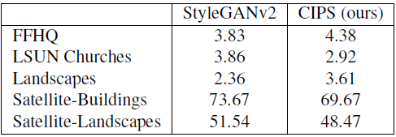

Table 1. 2562해상도에서의 FID 비교, StyleGAN2와 견줄만하다.

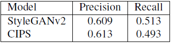

Table 2. Precision은 향상, Recall은 살짝 떨어지는 결과

실험 결과표를 보면 FID Score가 StyleGAN2와 견줄만한 수준으로 볼 수 있다.
다만 256 해상도에 대한 것으로 1024에 대해서는 어떨지 모르겠다.

### CIPS Module의 효과
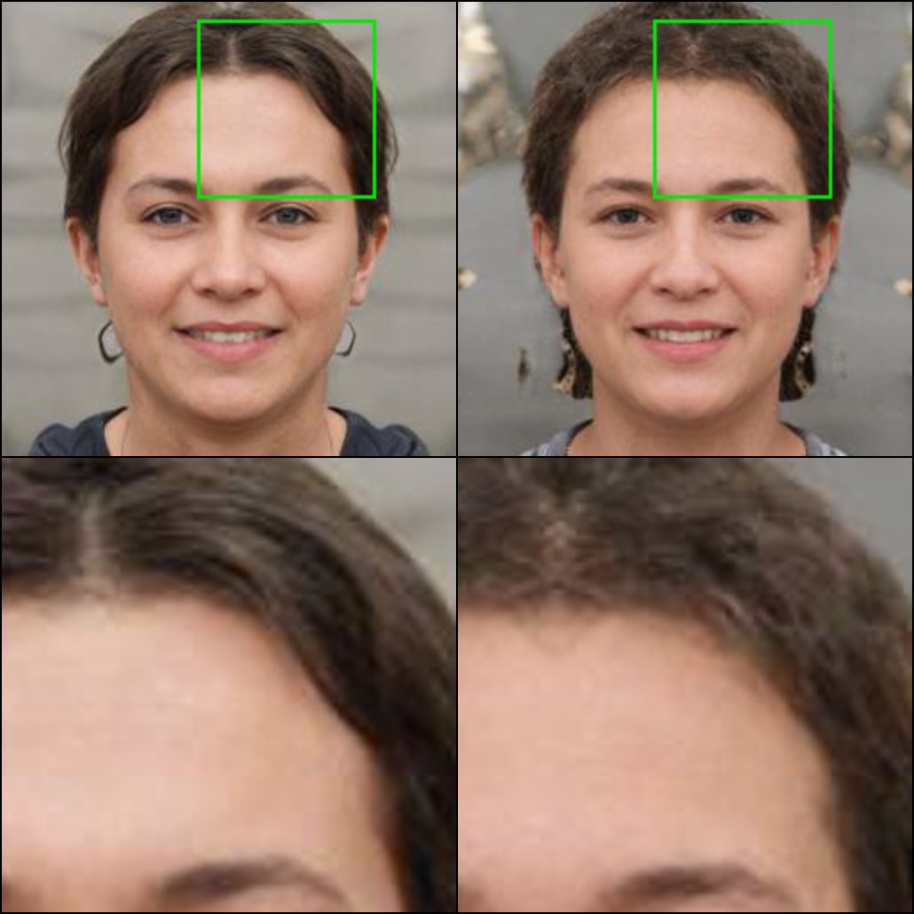

mean style vector 결과물 (좌: CIPS, 우: CIPS-NE)


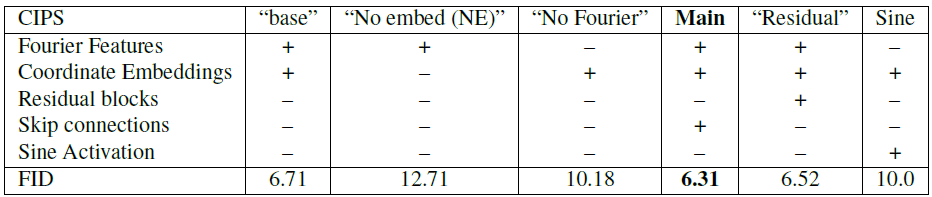
Table 3. CIPS에서 각 모듈의 사용유무에 따른 FID

다음은 CIPS의 각 모듈이 정말 효과적인지 알아보는 실험이다.

Table 3에서 +가 해당 모듈을 사용한 것이고 -는 해당 모듈을 제외한 것이며 마지막의 Sine Activation 행은 첫 레이어만 쓰는 것이 -, 모든 레이어에 다 사용한 것이 +다.

실험에서 Coordinate embedding의 유무가 가장 큰 성능 차이를 가져오며, 위의 Figure을 보면 알 수 있다.

### Positional Encoding의 특징
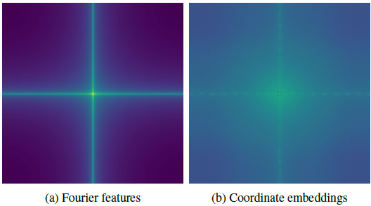
Spectrum magnitude, (a)보다 (b)의 출력이 고주파 성분이 더 많음.

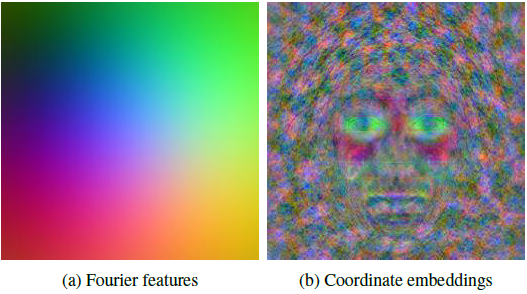
PCA plot (3 components -> RGB로 이미지 표현), (b)는 세부묘사와 keypoints를 포함하고 있음

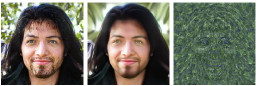

Left: Original, Center: Coordinate embeddings을 0으로 입력, Right: Fourier features를 0으로 입력


다음으로 Fourier features와 Coordinate embeddings의 차이를 알아보자.

위의 세 Figure들을 보면 Coordinate embeddings가 더 세부적인 정보를 포함하고 있음을 알 수 있다.

단순하게 이를 설명하자면 Fourier features는 입력 좌표에 따라 결정되는 반면,

Coordinate embeddings는 Constant값이므로 각각의 픽셀과 무관하게 학습 도메인의 공통적인 특징들을 학습한 것이기 때문이다.

### Spectral analysis
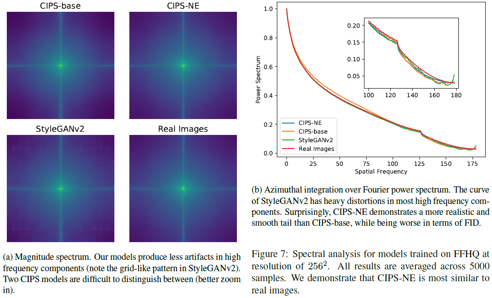
FFHQ 데이터로 학습한 모델의 Spectral 분석, CIPS-NE가 실제 데이터와 가장 유사함

CIPS는 픽셀 좌표에 따라 동작하고 upscaling을 하지 않는다.

그래서 Spectral을 Convolutional Upsampling을 사용하는 StyleGAN2와 비교하였는데, StyleGAN2의 Magnitude Spectrum을 보면 고주파 영역에 점이 좌표 칸처럼 찍혀있는 것을 볼 수 있지만 CIPS는 깔끔하다.

 

그런데 CIPS-base보다 CIPS-NE가 더 실제 데이터와 가까운 것은 FID Score의 차이를 생각하면 상당히 의외다.

논문에서 자세히 설명하지는 않는데 저자도 정확하게 분석하지는 못한 것으로 보인다.

다만 skip connection이 자연적인 이미지를 만드는데 방해되는 것으로 보인다는 결론만 남겼다.

### Foveated rendering

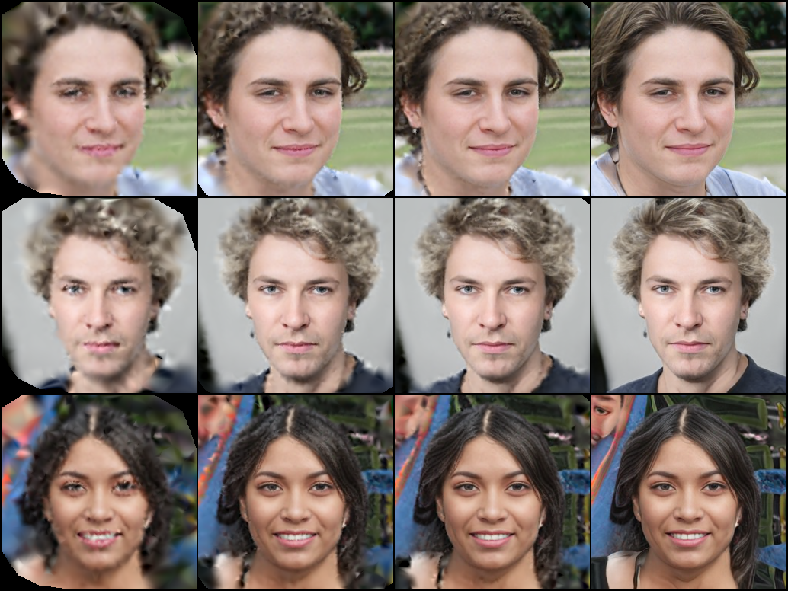
Foveated Synthesis, 전체 픽셀 중 일부만 합성하고 나머지는 bicubic interpolation으로 채우는 것. (좌->우: 5%, 25%, 50%, 100%)

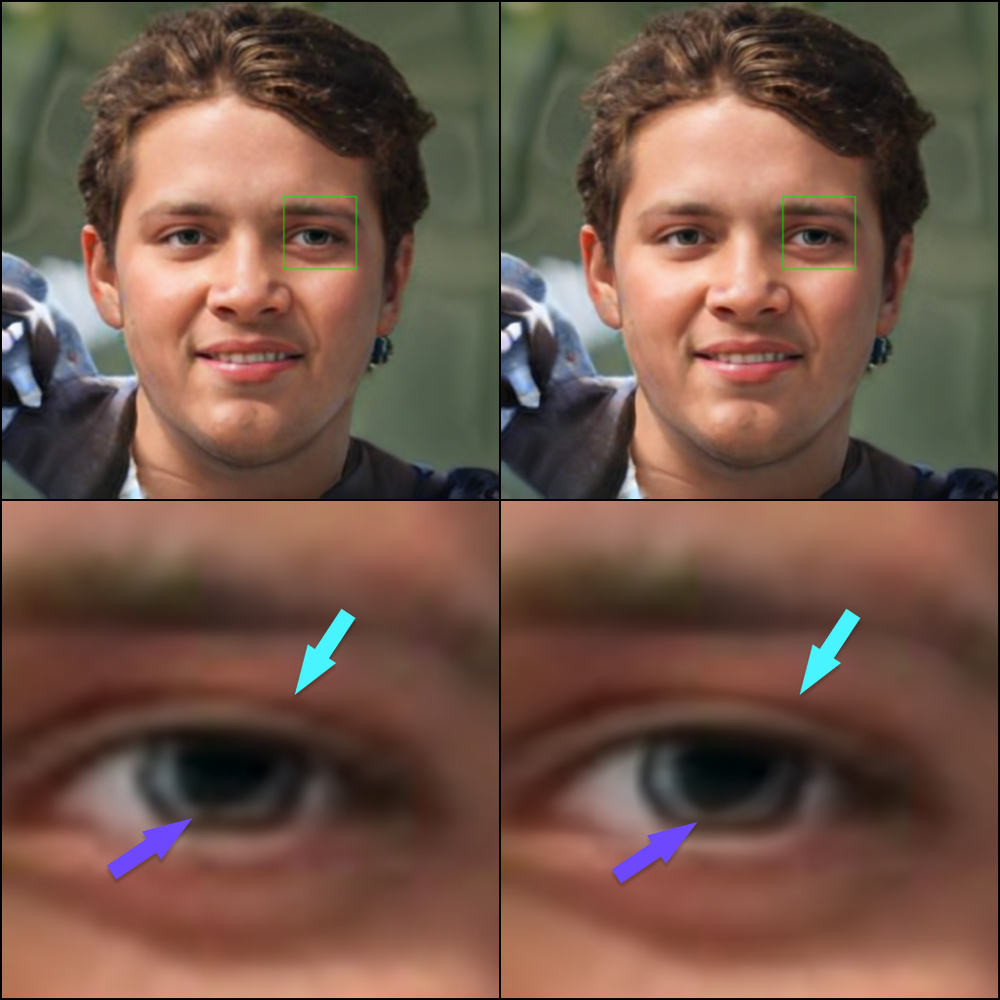

좌 : 256^2 로 생성한 이미지를 Lanczos upsample, 우 : 256^2 학습한 모델에 1024^2 좌표를 입력하여 생성한 것.


Foveated rendering은 각각의 픽셀을 독립적으로 생성한다는 특징을 활용한 것인데, Figure 8은 전체 이미지의 중심을 기준으로 0.4 std gaussian 분포로 픽셀을 샘플링하여 생성한 것으로 이미지 전체를 생성하지 않고 일부만 생성하여 연산 비용을 줄이는 방법이다.

실제 우리 눈의 망막은 중심부만 제대로 관측하고 그 외부는 제대로 관측되지 않는다. 비슷하게 게임에서도 우리의 시야에 보이는 부분만 보여주고 나머지는 Rendering을 생략하여 연산 비용을 낮추는 기술로 사용하고 있다.

위 Figure 는 단순히 좌표 grid를 좀 더 세밀하게 sampling 하여 고해상도 결과물을 생성한 것이다.

세밀한 grid로 생성한 것이 upsampling 한 것보다 더 선명한 것을 볼 수 있다.

이 1024^2 해상도 결과물의 FID는 어떠한지 궁금한데 논문에 따로 기록되어 있지는 않다.

### Interpolation
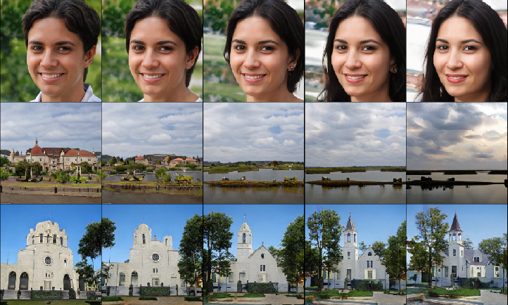

Latent Interpolation.


### Panorama synthesis
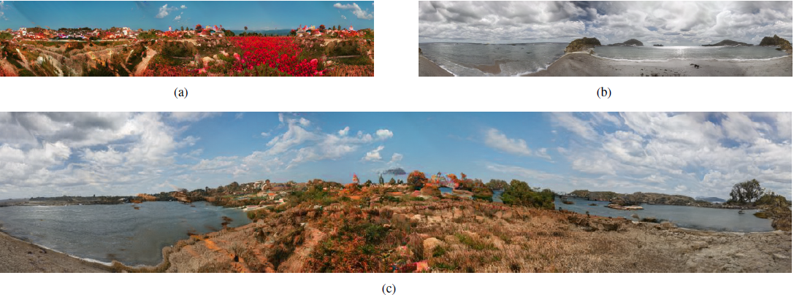

Panorama 합성, 원통좌표계로 변환하여 학습하고 좌표 Grid를 세밀하게 샘플링하여 생성한 결과물.

Panorma 합성은 개인적으로 신기했던 실험이었다.

기존의 다른 좌표계 기반 모델 같은 경우 애초에 Panorama 사진만을 데이터로 사용하여 학습하였는데 CIPS는 Panorama 데이터는 전혀 사용하지 않고 단순히 일반 사진을 원통 좌표계로 변환하여 학습했지만 좋은 결과물을 보여준다.

또 Style Interpolation도 원활하게 잘 되는 것을 볼 수 있다.

### Typical artifacts
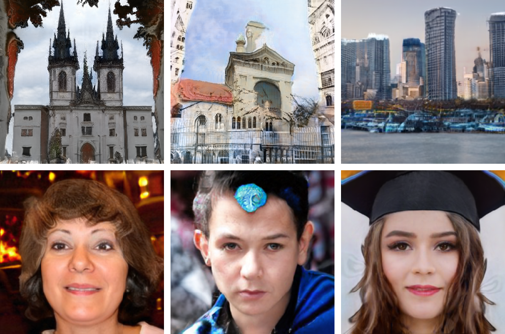

저자가 쭉 서술한 것을 봤을 때는 artifact 문제가 없는 줄 알았으나 CIPS 결과물은 artifact가 꽤 빈번하게 나타나는 것으로 보인다.

Fourier features를 연산할 때 sin을 취함으로써 발생하는 파동과 같은 무늬들이 많이 보인다. 또 저자는 LeakyReLU를 사용한 것 또한 좌표계를 여러 부분으로 나눔에 따라 이러한 artifact를 유도한다고 분석하고 있다.

StyleGAN2 저자는 StyleGAN에서 AdaIN이 이미지의 일부분에 아주 강력한 신호를 발생하는 식으로 잘못된 신호를 왜곡하여 학습하기 때문에 artifact가 나타나는 것으로 보았고 이를 ModConv로 수정하여 artifact를 제거하는 것에 성공했다.

그런데 동일한 개념의 ModFC를 사용하여도 이것은 해결이 안 되었던 것 같다.


개인적으로 생각했을 때의 원인은 다음과 같다.
StyleGAN2에서 Upsampling 할 때 FIR Filter를 통해 신호를 고르게 분산시킨다.

(사실 이 신호 분산은 ModConv를 사용하기 전인 StyleGAN에서도 적용되었던 것이고 artifact가 발생했었다.)
하지만 CIPS는 그러지 않고 하나의 픽셀에 대해서만 신호를 갖기 때문에 신호 분산이 되지 않는다.
그래서 특정 부분에서 잘못된 신호를 학습하여 artifact가 발생하는 것이 아닐까 추측한다.


저자는 CIPS가 다른 픽셀 정보나 upsampling을 하지 않기 때문에 generator를 보호하지 못한다라고 하는데 다른 픽셀 정보를 쓰지 않는 것은 위의 추측과 비슷한 이유겠지만 upsampling 하지 않기 때문이라는 것은 솔직히 잘 이해되지 않는다.

## Conclusion
CIPS라는 픽셀을 독립적으로 생성하여 고품질의 이미지를 만들어낼 수 있는 모델을 제안함
Spatial Convolution, Attention, Upsampling을 사용하지 않았음에도 StyleGAN2에 준하는 결과물
실제 데이터의 Spectral 분포에 더 가까운 결과물
좌표를 입력하여 생성하는 것은 다양한 가능성을 열어줌 (ex. 파노라마 생성)

## +
* 파노라마 결과가 매우 인상적이었음
* 좌표 grid 값으로 [0, 1]을 벗어난 범위(ex. [-0.5, 1.5])를 입력하면 어떤 결과가 나올지 궁금함
* StyleGAN2는 고해상도의 이미지를 실사에 가까운 품질로 생성할 수 있다는 것이 강점인데, 1024 해상도에서 정량지표를 비교한 자료가 없고 256 해상도에 대해서만 FID를 비교한 것이 아쉬움
* Spectral 분포 실험 결과의 분석이 미흡함, 왜 CIPS-NE가 더 좋은 결과를 갖는지 의문으로 남음
* Artifact 발생 원인에 대한 분석이 명확하지 않음

```toc
```