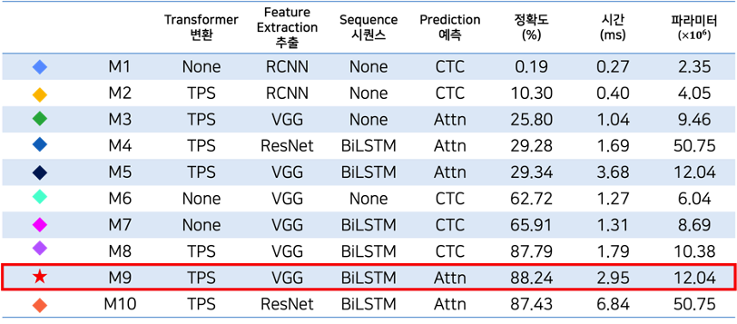

# (Growth) Capstone Design Project : Scene Text Recognition 데이터셋 및 모델 구현

## 문제점 인식

최근 잘못된 번역의 외국어 메뉴판 제공으로 음식 이해도가 낮아지고 있다. 현재 식당마다 일관되지 않은 방법으로 한식 메뉴를 표기하고 있다. 곰탕을 "Bear Soup", 육회를 "Six times"으로 표기한 잘못된 한식 메뉴의 영문 표기 사례도 최근 논란이 되고 있다. 이렇게 잘못된 번역의 한식 메뉴판 때문에 외국인들은 부정확한 정보를 얻게 된다. 외국인들은 한국 음식을 기억하지 못할 뿐더러 음식의 재료와 맛을 파악하지 못한다는 문제점을 야기한다. 따라서 이러한 문제점에서 착안하여 우리는 캡스톤 디자인 프로젝트 주제로, **AI 기반 메뉴판/간판 텍스트 검출 기술(STR; Scene Text Recognition)을 이용한 음식 검색 어플리케이션 개발을 진행**하기로 했다.

# Scene Text Recognition을 위해 선행 공부한 Paper Summary

## - What Is Wrong With Scene Text Recognition Model Comparisons? Dataset and Model Analysis [[paper link]](http://github.com/clovaai/deep-text-recognition-benchmark#run-demo-with-pretrained-model)

텍스트 인식 모델 (Scene Text Recognition)에 대해서 평가 데이터셋이 일관되지 않아, 해당 모델들의 정확한 성능 비교가 어렵다는 점을 문제로 삼아 나온 논문이다. 해당 논문은 아래의 세 가지 내용들을 통해 모델의 성능 비교 어려움을 해소하는 점에 기여했다. 

<aside>
💡 1) 일관성 없는 학습과 평가 데이터셋을 검사한다. 모델 성능 차이는 학습과 평가 데이터셋의 모순에서 비롯된다.

2) 기존에 있는 STR 모델과 적합한 통일된 4단계 모듈(Trans, Feat, Seq, Pred)의 STR Framework를 소개한다.

3) **일관성 있는 학습 및 평가 데이터셋**을 통해 정확도, 속도 및 메모리 소비량 측면에서 성능에 대한 모듈의 기여도를 분석한다.

</aside>

즉, 논문에서는 최종적으로 일관적인 데이터셋, 즉 7개의 벤치마크 평가 데이터셋과 2개의 교육 데이터셋(MJ와 ST)이라는 일관된 데이터셋뿐만 아니라 주요 STR 방법들 간의 공통 프레임워크(변환(Trans.), 형상 추출(Feat.), Sequence 모델링(Seq.) 및 예측(Pred.))를 도입했다.  비교한 주요 STR 방법들 중에서 공정한 비교를 제공했고, 어떤 모듈이 가장 정확하고, 속도, 그리고 크기 향상을 가져오는지 분석하였다.

## - Character Region Awareness for Text Detection (CRAFT) [[paper link]](http://openaccess.thecvf.com/content_CVPR_2019/papers/Baek_Character_Region_Awareness_for_Text_Detection_CVPR_2019_paper.pdf)

**모델의 목적은 입력으로 사용한 이미지에 대해 ‘픽셀’마다 다음의 두 값을 예측하는 것이다.** 

<aside>
💡 1) **Region score**는 해당 픽셀이 문자(Character)의 중심일 확률을 의미한다.
2) **Affinity score**는 해당 픽셀이 인접한 두 문자의 중심일 확률을 의미한다. 이 점수를 기반으로 개별 문자가 하나의 단어로 그룹화될 것인지가 결정된다.

</aside>


위의 이미지처럼 *Region score(좌측 하단)*는 각 픽셀이 문자의 중심에 가까울수록 확률이 1에 가깝고 문자 중심에서 멀수록 확률이 0에 가깝도록 예측하는 모델을 학습하는 것이다.

이와 동시에 동일 모델은 각 픽셀이 인접한 문자의 중심에 가까울 확률인 *Affinity score(우측 하단)*도 예측할 수 있어야 한다.

잘 학습된 모델을 통해 입력 이미지의 *Region score*와 *Affinity Score*를 예측하면 최종적으로 Text Recognition 결과를 얻을 수 있다.

**Scene Text Recognition의 성능을 높이기 위해서는 글자 인식 부분에 초점을 맞추어야 한다고 생각하여 이를 중점으로 STR 모델과 데이터셋을 구성하고 구현하였다.**

## 데이터셋 구성

먼저 모델의 Train에 사용될 데이터셋을 구성하기에 앞서 미리 구성된 데이터셋을 공부해보기로 했다. 가장 대표적이고 세계적으로 OCR대회를 주최하는 유명한 학회인 ICDAR에서 제공하는 데이터셋들을 둘러보았다. 대회 Task별로 데이터셋의 형태는 다양하며 우리 팀이 하려는 목적은 OCR 즉, Scene Text Recognition에 초점을 맞추어서 Text Recognition Task의 데이터셋을 공부했다. 가장 대표적인 데이터셋으로 많은 STR 논문에 등장한 2015년에 열린 ICDAR Incidental Scene Text 대회의 Task 4.3 Word Recognition을 먼저 보자!

- **선행 데이터셋 탐구 : ICDAR IC15 Dataset(Task 4.3)**
    - original dataset link : [https://rrc.cvc.uab.es/?ch=4&com=tasks](https://rrc.cvc.uab.es/?ch=4&com=tasks)


데이터셋은 이미지에서 단어 부분만 초점을 맞춰서 잘려진(Cropped) 형태로의 이미지 데이터와 이미지 파일 이름과 매칭된 정답 텍스트 파일 데이터(ground truth, "gt.txt")로 이루어져있다. Text Recognition 모델이 이미지/영상에서 Detect한 단어들을 위와 같이 bounding box 형태로 알려준다. 

***따라서 위와 같은 방법에서 착안하여 한글 데이터 셋을 구성하여 이미지 데이터와 정답 텍스트 파일 데이터를 한 pair로 구성하여 AI 모델의 training dataset으로 train시키기로 결정했다.***

ICDAR 학회는 세계적인 대회이므로 영어 데이터셋만 구성되어 있다. 따라서 우리 팀은 한식, 즉 한글 음식 명 데이터를 recognition해야하는 task를 다루므로 한글 데이터셋을 위와 같은 방법으로 구성하여 모델에 train 시켜야 한다. 따라서 한글 데이터셋이 필요하여 이 과정을 [1학기 Start팀 시기에 했던 방법](https://www.notion.so/Capstone-Design-Project-OCR-5a55b68aefd64646b4d1df3a895b48b1)(링크 참조) 과 동일하지만 좀 더 다양한 text를 인식할 수 있도록 효과를 추가하여 데이터셋을 구성했다.

- 최종 데이터셋
    - 아래와 사진과 같은 단어 사전(5965개의 가나다순의 단어로 구성)에서 랜덤으로 단어를 선정
    
    
    
    - 65개의 손글씨를 통해 100,099개의 한글 이미지를 직접 생성한 데이터셋과 공공 데이터 AI Hub에서 제공하는 현대 한글 11,172자를 가장 많이 활용하는 폰트 50개를 이용해 생성한 데이터셋을 한글 문장 데이터셋 사용
        - 직접 생성한 데이터셋
        
        
        
                                                               폰트는 총 65개의 폰트들을 데이터셋으로 사용하였다.
        
        - 공공 데이터 AI Hub에서 제공한 데이터셋
        
        
        
        AI Hub에서 제공하는 한글 이미지 데이터에는 손글씨, 인쇄체, Text in Wild(실생활 속 이미지에 적힌 한글)로 이루어져 있다. 우리 팀은 메뉴판 데이터를 다루기에 손글씨 데이터를 사용했다.  
        
    - 그리고 더하여 위의 단계들에서 생성한 한글 데이터셋을 아래의 예시 사진들과 같이 기본, 기울기, 노이즈, 왜곡, 흐리게 효과를 준 5종류의 한글 문장 데이터셋 추가적으로 생성했다,
        
        —> 사용자의 관점에서 생각하면 메뉴판을 촬영할 때 여러 각도와 노이즈가 섞인 상태와 저화질의 데이터도 모델에 전달될 수 있다고 생각되어 기울어진 상황, 노이즈, 왜곡, blur 처리가 된 데이터도 함께 train 하면 정확도가 증가할 것이라고 생각했다. 
        
        - 기본
            
            
            
        - 기울기
            
            
            
        - 노이즈
            
            
            
        - 왜곡
            
            
            
        - 흐리게
            
            
            
        
    - 1개의 문장 데이터가 포함하는 단어의 개수는 10개로 설정

이후 완성한 한글 문장 데이터셋을 사용할 [1학기의 paper review를 진행한 Text Recognition](https://www.notion.so/Capstone-Design-Project-OCR-5a55b68aefd64646b4d1df3a895b48b1) 모델에 맞추어서 IC15 데이터셋과 같은 형태로 processing 하였다.  따라서 data 폴더의 구조는 아래 그림과 같이 이뤄져야 한다.

```markdown
# data 폴더의 구조
├── gt.txt
└── test
		└── word_1.png
		└── word_2.png
		└── .....
```

```markdown
# gt.txt의 구조
test/word_1.png word_1
test/word_2.png word_2
```


     위의 구조로 이루어진  정답 데이터인 ground truth 텍스트 데이터

이렇게 하고 나면 Text Recognition 모델을 학습시기키 위한 준비는 다 끝났다. 다음 챕터에서는 실제 학습을 진행하는 과정과 한글 학습을 위해 모델 그리고 학습 결과에 대한 내용을 다룰 것이다.

---

# Scene Text Recognition Model 학습하기

## Conda 환경 설정

conda는 CUDA 10.2, python 3.7의 학습 환경에서 진행했다. 

```python
conda create -n Mein_STR python=3.7
conda activate Mein_STR

conda install pytorch torchvision cudatoolkit=10.2 -c pytorch
pip3 install lmdb pillow torchvision nltk natsort openv-python
```

## LMDB 데이터셋 생성

위의 데이터셋을 생성하는 과정에서 완성된 한글 문장 데이터셋을 train, validation, test set으로 나누고 각각 데이터의 annotation인 gt_train.txt, gt_validation.txt, gt_test.txt를 만들어 저장한 후 위 챕터에서 언급한 디렉토리 구조로 두었다. 

```python
data
├── gt_train.txt
└── train
    ├── word_1.png
    ├── word_2.png
    ├── word_3.png
    └── .....

# gt_train.txt 포맷 예시 \t 으로 구분되며 문장의 끝에는 \n
train/word_1.png word_1
train/word_2.png word_2
train/word_3.png word_3
.....
```

그리고는 다음 코드를 이용해서 이미지와 ground truth가 적힌 라벨링 텍스트 파일을 LMDB 파일로 변환한다.

```python
#pip3 install fire
python create_lmdb_dataset.py --inputPath data/ --gtFile data/gt_train.txt --outputPath data_lmdb/train

python create_lmdb_dataset.py --inputPath data/ --gtFile data/gt_validation.txt --outputPath data_lmdb/validation
```

```python
""" create_lmdb_dataset.py  """
import fire
import os
import lmdb
import cv2

import numpy as np

def checkImageIsValid(imageBin):
    if imageBin is None:
        return False
    imageBuf = np.fromstring(imageBin, dtype=np.uint8)
    img = cv2.imdecode(imageBuf, cv2.IMREAD_GRAYSCALE)
    imgH, imgW = img.shape[0], img.shape[1]
    if imgH * imgW == 0:
        return False
    return True

def writeCache(env, cache):
    with env.begin(write=True) as txn:
        for k, v in cache.items():
            txn.put(k, v)

def createDataset(inputPath, gtFile, outputPath, checkValid=True):
    """
    Create LMDB dataset for training and evaluation.
    ARGS:
        inputPath  : input folder path where starts imagePath
        outputPath : LMDB output path
        gtFile     : list of image path and label
        checkValid : if true, check the validity of every image
    """
    os.makedirs(outputPath, exist_ok=True)
    env = lmdb.open(outputPath, map_size=1099511627776)
    cache = {}
    cnt = 1

    with open(gtFile, 'r', encoding='utf-8') as data:
        datalist = data.readlines()

    nSamples = len(datalist)
    for i in range(nSamples):
        imagePath, label = datalist[i].strip('\n').split('\t')
        imagePath = os.path.join(inputPath, imagePath)

        # # only use alphanumeric data
        # if re.search('[^a-zA-Z0-9]', label):
        #     continue

        if not os.path.exists(imagePath):
            print('%s does not exist' % imagePath)
            continue
        with open(imagePath, 'rb') as f:
            imageBin = f.read()
        if checkValid:
            try:
                if not checkImageIsValid(imageBin):
                    print('%s is not a valid image' % imagePath)
                    continue
            except:
                print('error occured', i)
                with open(outputPath + '/error_image_log.txt', 'a') as log:
                    log.write('%s-th image data occured error\n' % str(i))
                continue

        imageKey = 'image-%09d'.encode() % cnt
        labelKey = 'label-%09d'.encode() % cnt
        cache[imageKey] = imageBin
        cache[labelKey] = label.encode()

        if cnt % 1000 == 0:
            writeCache(env, cache)
            cache = {}
            print('Written %d / %d' % (cnt, nSamples))
        cnt += 1
    nSamples = cnt-1
    cache['num-samples'.encode()] = str(nSamples).encode()
    writeCache(env, cache)
    print('Created dataset with %d samples' % nSamples)

if __name__ == '__main__':
    fire.Fire(createDataset)
```

## Train

** 코드가 꽤 길어 py 파일을 첨부한다. 자세한 내용은 github에 있으므로 참고바란다 :)

[train.py](./imagebundle/train.py)

[](https://s3-us-west-2.amazonaws.com/secure.notion-static.com/9ae9cae8-e9e0-4221-9483-095f3e8f27b6/train.py)

IC15, SynthText(ST) 등과 같이 영어 데이터셋으로 학습시키는 것을 기준으로 설명되어 있다. 그래서 train.py 학습 파일을 보면 argument에서 '0123456789abcdefghijklmnopqrstuvwxyz'인 단어들만 학습하도록 character에 설정되어 있다. 따라서 위에서 만든 한글 문장 데이터셋을 사용하기 위해서는 parser.add_argument 부분에 아래 코드와 같이 한글 학습을 위한 configuration을 추가해주어야 한다. 

```python
parser.add_argument('--character', type=str,
                        default='0123456789abcdefghijklmnopqrstuvwxyz가각간갇갈감갑값갓강갖같갚갛개객걀걔거걱건걷걸검겁것겉게겨격겪견결겹경곁계고곡곤곧골곰곱곳공과관광괜괴굉교구국군굳굴굵굶굽궁권귀귓규균귤그극근글긁금급긋긍기긴길김깅깊까깍깎깐깔깜깝깡깥깨꺼꺾껌껍껏껑께껴꼬꼭꼴꼼꼽꽂꽃꽉꽤꾸꾼꿀꿈뀌끄끈끊끌끓끔끗끝끼낌나낙낚난날낡남납낫낭낮낯낱낳내냄냇냉냐냥너넉넌널넓넘넣네넥넷녀녁년념녕노녹논놀놈농높놓놔뇌뇨누눈눕뉘뉴늄느늑는늘늙능늦늬니닐님다닥닦단닫달닭닮담답닷당닿대댁댐댓더덕던덜덟덤덥덧덩덮데델도독돈돌돕돗동돼되된두둑둘둠둡둥뒤뒷드득든듣들듬듭듯등디딩딪따딱딴딸땀땅때땜떠떡떤떨떻떼또똑뚜뚫뚱뛰뜨뜩뜯뜰뜻띄라락란람랍랑랗래랜램랫략량러럭런럴럼럽럿렁렇레렉렌려력련렬렵령례로록론롬롭롯료루룩룹룻뤄류륙률륭르른름릇릎리릭린림립릿링마막만많말맑맘맙맛망맞맡맣매맥맨맵맺머먹먼멀멈멋멍멎메멘멩며면멸명몇모목몬몰몸몹못몽묘무묵묶문묻물뭄뭇뭐뭘뭣므미민믿밀밉밌및밑바박밖반받발밝밟밤밥방밭배백뱀뱃뱉버번벌범법벗베벤벨벼벽변별볍병볕보복볶본볼봄봇봉뵈뵙부북분불붉붐붓붕붙뷰브븐블비빌빔빗빚빛빠빡빨빵빼뺏뺨뻐뻔뻗뼈뼉뽑뿌뿐쁘쁨사삭산살삶삼삿상새색샌생샤서석섞선설섬섭섯성세섹센셈셋셔션소속손솔솜솟송솥쇄쇠쇼수숙순숟술숨숫숭숲쉬쉰쉽슈스슨슬슴습슷승시식신싣실싫심십싯싱싶싸싹싼쌀쌍쌓써썩썰썹쎄쏘쏟쑤쓰쓴쓸씀씌씨씩씬씹씻아악안앉않알앓암압앗앙앞애액앨야약얀얄얇양얕얗얘어억언얹얻얼엄업없엇엉엊엌엎에엔엘여역연열엷염엽엿영옆예옛오옥온올옮옳옷옹와완왕왜왠외왼요욕용우욱운울움웃웅워원월웨웬위윗유육율으윽은을음응의이익인일읽잃임입잇있잊잎자작잔잖잘잠잡잣장잦재쟁쟤저적전절젊점접젓정젖제젠젯져조족존졸좀좁종좋좌죄주죽준줄줌줍중쥐즈즉즌즐즘증지직진질짐집짓징짙짚짜짝짧째쨌쩌쩍쩐쩔쩜쪽쫓쭈쭉찌찍찢차착찬찮찰참찻창찾채책챔챙처척천철첩첫청체쳐초촉촌촛총촬최추축춘출춤춥춧충취츠측츰층치칙친칠침칫칭카칸칼캄캐캠커컨컬컴컵컷케켓켜코콘콜콤콩쾌쿄쿠퀴크큰클큼키킬타탁탄탈탑탓탕태택탤터턱턴털텅테텍텔템토톤톨톱통퇴투툴툼퉁튀튜트특튼튿틀틈티틱팀팅파팎판팔팝패팩팬퍼퍽페펜펴편펼평폐포폭폰표푸푹풀품풍퓨프플픔피픽필핏핑하학한할함합항해핵핸햄햇행향허헌험헤헬혀현혈협형혜호혹혼홀홈홉홍화확환활황회획횟횡효후훈훌훔훨휘휴흉흐흑흔흘흙흡흥흩희흰히힘?!', 
										help='character label')

parser.add_argument('--select_data', type=str, default='/',
                        help='select training data (default is MJ-ST, which means MJ and ST used as training data)')
parser.add_argument('--batch_ratio', type=str, default='1',
                        help='assign ratio for each selected data in the batch')
```

- -character에서 defult='0123456789abcdefghijklmnopqrstuvwxyz'를 학습할 문자들로 고치기
- -select_data에서 default='MJ-ST'를 '/'로 수정
    - MJ, ST 데이터셋이 아닌 우리가 만든 커스텀 데이터셋인 한글 문장 데이터셋을 사용할 것이므로
- -batch_ratio에서 default='0.5-0.5'를 '1'로 수정
    - 커스텀 데이터셋이 multi language가 아닌 한글 1종류이기 때문에

```python
CUDA_VISIBLE_DEVICES=0 python train.py 
					--train_data data_lmdb/train 
					--valid_data data_lmdb/validation \
					--Transformation TPS 
					--FeatureExtraction ResNet 
					--SequenceModeling BiLSTM 
					--Prediction CTC \
					--data_filtering_off --imgH 64 --imgW 200
```

입력으로 들어가는 이미지의 해상도를 높이기 위해 imgW, imgH 옵션을 다르게 해 주었다.  4단계 모듈(Trans, Feat, Seq, Pred)의 STR Framework의 옵션을 각각 다르게 해서 실험을 진행했다.

- 학습이 잘 되고 있다면 다음과 같은 결과가 validation interval마다 나올 것이다.

```python
[300000/300000] Loss: 0.00038 elapsed_time: 278098.39510
하얀색전국떼다슬쩍도시락영쉰영화관앞쪽대, gt: 하얀색전국떼다슬쩍도시락영쉰영화관앞쪽대,   True
회원전해지다대중교통새기다볶음운동장말다구하다소규모반대, gt: 회원전해지다대중교통새기다볶음운동장말다구하다소규모반대,   True
이외소형마당속현작다불평등하다중심소화위반하다, gt: 이외소형마당속현작다불평등하다중심소화위반하다,   True
교환박사수컷물기통깍두기형식적이상적살인열차, gt: 교환박사수컷물기통깍두기형식적이상적살인열차,   True
뿌리다톤얄밉다넘어서다누구핵심차례답하다쓰러지다교재, gt: 뿌리다톤얄밉다넘어서다누구핵심차례답하다쓰러지다교재,   True
[300000/300000] valid loss: 0.47174 accuracy: 83.677, norm_ED: 537.98
```

# Experiment


STR을 위해 사용한 글자 인식 모델은 총 4단계 모듈(Trans, Feat, Seq, Pred)의 Framework로 구성되어 있다.

4단계 모듈 마다 각각 적용할 수 있는 구조를 다르게 하여 가장 높은 정확도가 나오는 모델을 최종 글자 인식 모델로 사용할 것이다. 

[Table](./imagebundle/Table.csv)

```python
CUDA_VISIBLE_DEVICES=0 python train.py 
					--train_data data_lmdb/train 
					--valid_data data_lmdb/validation \
					--Transformation """{TPS, None}""" 
					--FeatureExtraction """{VGG, ResNet, RCNN}"""  
					--SequenceModeling """{BiLSTM, None}""" 
					--Prediction """{CTC, Attention}""" \
					--data_filtering_off --imgH 64 --imgW 200
```


     위의 사진은 모듈의 옵션을 다르게 조합하여 실험한 결과를 저장한 파일들이다.

아래는 위의 코드로 각 모듈의 옵션을 달리 실험한 결과를 정리한 표와 그래프, 분석 결과이다.




- 가장 높은 정확도를 보인 모델 조합은 TPS-VGG-BiLSTM-Attention (M9)이다.
- 변환(Transformer) 모듈에서 TPS를 사용할 때 파라미터 수는 1.6M으로 일정하고, 추론시간은 증가하지만, 정확도가 최대 34%까지 향상되는 결과를 보였다.
- 추출(Feature Extraction) 모듈에서 VGG와 ResNet을 사용하였을 때의 결과가 RCNN을 사용했을 때보다 높은 정확도를 보였고 모델 간 평균 파라미터 수를 비교했을 때는 ResNet, VGG, RCNN 순의 결과를 보였다.
- 시퀀스(Sequence) – 예측(Prediction) 모듈에서 BiLSTM-Attention 조합이 BiLSTM을 사용하지 않을 때보다 정확도가 높은 결과를 보였다.
    - BiLSTM-Attention 조합이 함께 사용했을 때 정확도를 향상시키는 효과가 나타났다.

보다 상세한 코드는 아래의 깃헙 레파지토리를 참고하면 된다.

[Github]

[Mein_Flutter/STR at master · hagyeonglee/Mein_Flutter](https://github.com/hagyeonglee/Mein_Flutter/tree/master/STR)

[App Demo 영상]

[https://youtu.be/nDoO2a9Fvj0](https://youtu.be/nDoO2a9Fvj0)