# Implicit Neural Representations for Image Compression

## Introduction
- preserves all the information (lossless compression)
- sacrifices some information for even smaller file sizes (lossy compression)

정보를 모두 보존하는 방향으로의 compression 또는 조금의 정보는 손실이 있어도 파일 크기를 더 줄이는 방향으로의 compression이 존재한다. 

—> fundamental theoretical limit (Shannon’s entropy)

정보 손실없는 compression이 더 desirable하지만 기본 이론적 한계가 존재한다. 샤넌의 엔트로피는 정보를 표현하는데 필요한 최소 평균 자원량을 말하는데, 샤넌은 아무리 좋은 코드를 설계하더라도 평균 길이가 엔트로피 H(X)보다 짧아질 수 없음을 밝혔다.

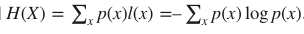

- Therefore, lossy compression aims at trading off a file’s quality with its size - called rate-distortion trade-off.

그러므로, lossy compression(정보를 조금 손실해도 파일의 크기를 더 줄일 수 있는 방향으로의 compression)은 파일의 퀄리티와 사이즈에 대한 trading off를 목표로 한다. (rate-distortion trade-off 라고 부르는 trade off이다.)

- machine learning research has recently developed promising learned approaches to source compression by leveraging the power of neural networks
    - Rate-Distortion Autoencoders (RDAEs) : jointly optimize the quality of the decoded data sample and its encoded file size.
        
        (RDAE : 디코딩된 데이터 샘플의 품질과 인코딩된 파일 크기를 공동으로 최적화)
        
    
    —> sidesteps the prevalent approach of RDAEs ; focusing on ***image compression***
    
    RDAE의 일반적인 접근 방식을 피해서 특히 영상 압축에 초점을 맞춘 소스 압축의 새로운 패러다임을 조사한다.
    
- Implicit Neural Representations (INRs) gained popularity as a flexible
- INRs —> multi-purpose data representation that is able to produce high-fidelity samples on images, 3D shapes, and scenes.
    
    flexible한 방법으로 다양한 목적의 데이터 표현을 가능하게 하여 images, 3D shapes, and scene에 높은 정밀도의 샘플을 생성할 수 있게 해준다.
    
- INRs represent data that lives on an underlying regular grid by learning a mapping between the grid’s coordinates and the corresponding data values (e.g. RGB values)
    
    INR은 좌표와 그에 해당하는 데이터 value(예를 들면 RGB 값들)를 매핑하여 regular grid에 존재하는 데이터를 표현한다.
    
- INRs have even been hypothesized to yield well compressed representations
    
    (INR은 심지어 잘 압축된 표현을 산출한다는 가설도 있다. )
    

⇒ How good are these INRs in terms of rate-distortion performance?

(INR이 rate-distortion 측면에서 얼마나 우수한지에 대해 궁금해지게 된다. 그러나 지금까지 INR은 소스 압축에 대한 연구에서 놀라울 정도로 빠져있었다. 이에 대해서 연구한 논문은 COIN과 NerV뿐이었다. )

- Why INRs have not been applied to image compression
    
    (1) Straightforward approaches struggle to compete even with the simplest traditional algorithms
    
    (간단한 접근 방식 (INR을 지칭하는 방식일 듯) 가장 단순한 전통적인 알고리즘과 경쟁하기 어렵다)
    
    (2) Since INRs encode data by overfitting to particular instances, the encoding time is perceived impractical.
    
    (특정 인스턴스에 오버피팅하여 데이터를 인코딩하므로 인코딩 시간이 오래 걸릴 것)
    

⇒ propose a **comprehensive image compression pipeline on the basis on INRs**.

(INR을 기반으로 종합적인 이미지 압축 파이프라인을 제안)

- our proposed method can easily be adapted to any coordinatebased data modality

(우리의 제안된 방법은 어떤 좌표 기반 데이터 양식에도 쉽게 적용)

- young field of INRs-based compression can greatly improve by making targeted choices regarding the neural network architecture

(INR 기반의 압축 분야는 뉴럴 네트워크 아키텍처와 관련해서 targeted 선택을 함으로써 크게 나아질 수 있을 것이다)

- meta-learning for INRs based on Model-Agnostic Meta-Learning(MAML) to find weight initializations
    - can compress data with fewer gradient updates
    
    → better rate-distortion performance
    
    (INR을 MAML 기반으로한 메타 러닝 방법을 웨이트 초기화를 위해 도입했다. 이는 더 작은 그래디언트 업데이트를 해서 데이터를 압축할 수 있게 하여 rate-distortion 측면에서 좋은 성능을 보였다.)
    

⇒ INRs are a promising emerging compression paradigm and primarily requires deriving architectures for INRs and meta-learning approaches tailored to compression needs.

(유망한 압축 패러다임이며, 주로 INR을 위한 아키텍처와 압축 니즈에 맞춘 메타 러닝 접근 방법을 요구한다.)

## Related Work

- Learned Image Compression
    - end-to-end autoencoder
    - entropy model
    - coarse-to-fine hierarchical hyperprior → NeRF
        - Coarse : 전체 set에서 서로 겹치지 않게 sample을 뽑는 방법, $N_C$ 개 만큼 뽑아서 Fully Connected layer에 넣어준다. Nc개에 대해서 sigma(volume density)와 color를 뽑을 수 있음. 그리고 normalize 시킴(전체 color에 얼마만큼 기여하는지를 알아보기 위해) → probability distribution을 만들 수 있음(Nc개의 point가 각각 최종 color에 얼마만큼의 확률이 반영되는지)
        - Fine : PDF(probability distibution f)를 고려하기 위해 PDF의 CDF(cumulative density f)의 inverse를 사용해서 sampling하는 방법 → PDF에서 peak 지점을 위주로 sampling 됨
    - achieve further improvements by adding attention modules and using a Gaussian Mixture Model (GMM) for latent representations
    - SOTA = invertible convolutional network, and apply residual feature enhancement as pre-processing and post-processing
    
    [Enhanced invertible encoding for learned image compression](https://www.notion.so/Enhanced-invertible-encoding-for-learned-image-compression-578b1d00f1324f1091904bdb2aaab313)
    
    - variable rate compression
        - RNN-based autoencoders
    - conditional autoencoders
    - propose image compression with Generative Adversarial Networks (GAN)
- Implicit Neural Representations
    - DeepSDF : neural network representation for 3D shapes
        
        (3D 공간을 표현하는 뉴럴 네트워크)
        
        [GitHub - facebookresearch/DeepSDF: Learning Continuous Signed Distance Functions for Shape Representation](https://github.com/facebookresearch/DeepSDF)
        
        - Signed Distance Function (SDF) : represent the shape by a field where every point in space holds the distance to the shape’s surface
            
            (특정한 공간상의 지점(point)의 좌표를 지정해주면 점과 어떠한 표면(surface)사이의 가장 가까운 거리를 반환하는 함수)
            
    - INRs have also been used for scene representation, image representation, and compact(압축된) representation
- Model Compression
    - past decades : proposes sequentially applying pruning, quantization and entropy coding combined with retraining in between the steps.
        
        (Deep compression 방법을 의미, 순차적으로 pruning, quantization, entropy coding을 진행했던 방법)
        
    - Later : suggests an end-to-end learning approach using a rate-distortion objective
        
        (end to end 방법 사용, 하나의 loss function에 대해 동시에 training)
        
        - To optimize performance under quantization,
            - mixed-precision quantization
            - post-quantization
- Model Weights for Instance Adaptive Compression
    - finetuning the decoder weights of an RDAE on a per instance basis
    - appending the weight update to the latent vector
    - However the RDAE architecture fundamentally differs from ours
    
    (기본적인 rate distortion autoencoder 구조와 다르게 사용했다)
    
    - COIN
        - overfits an INR’s model weights to represent single images and compresses the INR using quantization
        - `does not use post-quantization retraining, entropy coding and meta-learning for initializing INRs`
        
        [GitHub - EmilienDupont/coin: Pytorch implementation of COIN, a framework for compression with implicit neural representations 🌸](https://github.com/EmilienDupont/coin)
        
    - NeRV
        - use another data modality (audio, not image)
        - does not use post-quantization retraining, meta learned initializations
        
        [GitHub - haochen-rye/NeRV: Official Pytorch implementation for video neural representation (NeRV)](https://github.com/haochen-rye/nerv)
        

## **Method**

### Background

- INRs
    - store coordinate-based data by representing data as a continuous function
    from coordinates to values 
    - EX) x, y 좌표를 갖는 이미지 좌표  를 RGB와 같은 color space를 갖는 color vector와 매핑 :
        
        
        
    - This mapping can be approximated by a neural network $f_\theta$, typically a Multi Layer Perceptron (MLP) with parameters $\theta$
        
        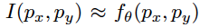
        
    - To express a pixel based image tensor x, evaluate the image function on a uniformly spaced coordinate grid p such that x = $I(p)\in R^{W*H*3}$,
        
        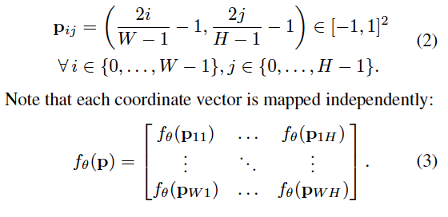
        
- Rate-distortion Autoencoders
    - An encoder network produces a compressed representation
        - latent vector $z \in R^d$
        - Early approaches enforce compactness of $z$ by limiting its dimension $d$
        - Newer methods constrain the representation by adding an entropy estimate of z to the loss. → rate loss
        - This rate term, reflecting the storage requirement of z, is minimized jointly with a distortion term, that quantifies the compression error.
        
        (z의 저장 요구사항을 반영한 rate term은 distortion term을 최소화하면서 압축 오류를 quantify, 수량화한다.)
        

### Image Compression using INRs

- In contrast to RDAEs, INRs store all information implicitly in the network weights $\theta$
- encoding process ⇒ training the INR
- decoding process ⇒ loading a set of weights into the network and evaluating on a coordinate grid
    
    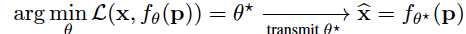
    
    only need to store $\theta ^*$ to reconstruct a distorted version of the original image x
    
    ⇒ method to find $\theta ^*$ to achieve compact storage and good reconstruction at the same time
    
- Architecture
    - use SIREN
        
        [GitHub - lucidrains/siren-pytorch: Pytorch implementation of SIREN - Implicit Neural Representations with Periodic Activation Function](https://github.com/lucidrains/siren-pytorch)
        
        - a MLP using sine activations with a frequency $w$ = 30
        - Since we aim to evaluate our method at multiple bitrates, we vary the model size to obtain a rate distortion curve.
        - how to vary the model size to achieve optimal rate-distortion performance
        and on the architecture of the INR
            
            ⇒ [Section] Number of Layers and Hidden Dimension & [Section] Choosing Input Encoding and Activation
            
- Input Encoding
    - An input encoding transforms the input coordinate to a higher dimension
        
        → improve perceptual quality
        
    - Best → the first to combine SIREN with an input encoding
    - positional encoding
        
        [cf) Positional Encoding ](https://www.notion.so/cf-Positional-Encoding-b2dd7519a3c94d7ead7e5deaa5f9be71)
        
        - `위치 정보를 그대로 입력 하는 것이 아니라 sin, cos 함수에 넣어서 훨씬 높은 차원 정보를 입력으로 넣는 것`
        - introduce the scale parameter $\sigma$ to adjust the frequency spacing and concatenate the frequency terms with the original coordinate $p$ (as in the codebase for SIREN)
            
            * L : the number of frequencies used
            
            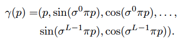
            
            → [Section] Choosing Input Encoding and Activation
            
- Compression Pipeline for INRs
    
    1) based on randomly initialized INRs
    
    2) meta-learned initializations (to improve INR based compression in terms of rate-distortion performance and encoding time)
    
    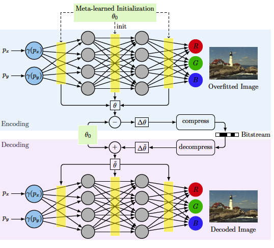
    

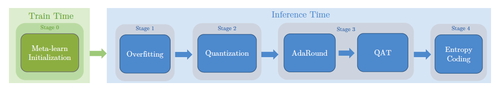

### **1) based on randomly initialized INRs**

[ Stage 1 ] Overfitting

- overfit the INR $f_\theta$ to a data sample
- overfitting to emphasize that the INR is trained to only represent a single image
    - Given an image x and a coordinate grid p, we minimize the objective:
        
        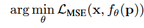
        
- Mean Squared Error (MSE) as the loss function to measure similarity
    
    *$x_{ij}$ is the color vector of a single pixel
    
    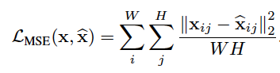
    
- Regularization
    
    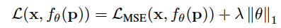
    
    - apply L1 regularization to the model weights → 중요한 특성만 남기기위해 정규화
    - L1 loss has the property of inducing sparsity
    - limiting the entropy of the weights (apply this to an INR, not decoder)

[ Stage 2] Quantization

- To reduce the memory requirement, we quantize the weights using the AI Model Efficiency Toolkit (AIMET)

[GitHub - quic/aimet: AIMET is a library that provides advanced quantization and compression techniques for trained neural network models.](https://github.com/quic/aimet)

- each weight tensor such that the uniformly spaced quantization grid is adjusted to the value range of the tensor
    
    (균일한 간격의 quantization grid가 tensor의 범위에 맞게 조정되도록 weight sensor에 특정 quantization을 수행)
    
- The bitwidth determines the number of discrete levels
    
    Ex) quantization bins
    
    (비트 너비에 따라 discrete level의 수가 결정)
    
    - range of 7-8 lead to optimal rate-distortion performance
    
    (7,8일 때가 적절한 값이었다)
    

[ Stage 3] Post-Quantization Optimization

- Quantization reduces the models performance by rounding the weights to their nearest quantization bin
    
    1) AdaRound(Adaptive Rounding) : a second-order optimization method to decide whether to round a weight up or down (웨이트를 올릴지 내릴지 반올림을 결정하는 2차 최적화 방법이다)
    
    → AIMET Toolkit에 있음
    
    2) Quantization Aware Training (QAT) : aims to reverse part of the quantization error, rely on the Straight Through Estimator (STE) for the gradient computation → bypassing the quantization operation during back propagation
    
    [Quantization Aware Training](https://www.notion.so/Quantization-Aware-Training-962de288396f426cbe92d5a5868f9bd2)
    
    (학습을 통한 quantization을 simulate, traning 과정 중에서 quantize 수행. Fake quantization node를 첨가하여 quantize되었을 시 어떻게 동작할지 시뮬레이션)
    
    cf ) [https://pytorch.org/blog/introduction-to-quantization-on-pytorch/](https://pytorch.org/blog/introduction-to-quantization-on-pytorch/) 
    

[ Stage 4] Entropy Coding

[GitHub - fab-jul/torchac: Entropy coding / arithmetic coding for PyTorch](https://github.com/fab-jul/torchac)

- perform entropy coding to further losslessly compress weights

(Data entropy를 기반으로 작동한다는 것은, 압축률이 데이터 내에서 각 소단위(bit, byte)들이 출현하는 빈도와 관련된다는 것 ex) huffman coding)

- binarized arithmetic coding algorithm
    - arithmetic coding : 전체 메시지를 0과 1 사이의 실수 구간으로 나타내는 coding
    
    [Arithmetic coding](https://www.notion.so/Arithmetic-coding-951c90dfd3f14a94b6ae002bfcb1871e)
    

### 2) Meta-learned Initializations for Compressing INRs

[GitHub - learnables/learn2learn: A PyTorch Library for Meta-learning Research](https://github.com/learnables/learn2learn)

- Directly applying INRs to compression has two severe limitations
    
    1) requires overfitting a model from scratch to a data sample during the encoding step
    
    2) does not allow embedding inductive biases into the compression algorithm
    
    (ex)knowledge of a particular image distribution)
    
    ⇒ meta-learning (Model Agnostic Meta-Learning (MAML))
    
- Model Agnostic Meta-Learning (MAML)
    
    [MAML](https://www.notion.so/MAML-e686975eeffd4b099d0b6e24fe1325b5)
    
    learning a weight initialization that is close to the weight values and entails information of the distribution of images
    
    - previous aimed at improving mainly convergence speed
    - The learned initialization $\theta_0$ is claimed to be closer in weight space to the final INR
    - the update $\triangle \theta = \theta - \theta_0$ requires less storage than the full weight tensor $\theta$
    - The decoder can then reconstruct the image by computing:
        
        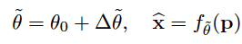
        
        - $\tilde \theta$ 가 의미하는 것 → reconstruct된 weight
        - $\hat x$ 가 의미하는 것 → $\tilde \theta$ 에 의해서 reconstruct된 이미지
    - the learning of the initialization is only performed once per distribution D prior to overfitting a single image
- Integration into a Compression Pipeline
    - encode only the update $\triangle \theta$
        
        (변화된 $\theta$만 인코딩해주면됨)
        
        During overfitting we change the objective to:
        
        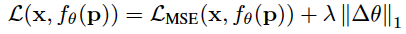
        
        → the regularization term now induces the model weights to stay close to the initialization
        
        we directly apply quantization to the update $\triangle \theta$
        
    - perform AdaRound and QAT, we apply a decomposition to all linear layers in the MLP to separate initial values from the update
        
        (AdaRound와 QAT를 수행하면서 업데이트된 값으로서부터 초기값을 분리해주기 위해 MLP에 있는 모든 선형 레이어에 decomposition 분해를 해준다.)
        
        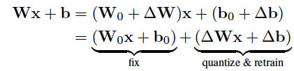
        
        - optimizing the rounding and QAT require the original input-output function of each linear layer
        
        (rounding과 QAT는 원본의 Input, output 함수의 모든 선형 레이어에서 최적화)
        
        - Splitting it up into two parallel linear layers, we can fix the linear layer containing W0 and b0 and apply quantization, AdaRound and QAT to the update parameters $\triangle W$and $\triangle b$.
        
        (W0와 b0, 초기값을 고정하면서 동시에 quantization AdaRound, QAT를 통해 파라미터들을 업데이트할 수 있다.)
        

## Experiments

### Datasets

- Kodak dataset
- DIV2K
- CelebA

### Metrics

- **bitrate**

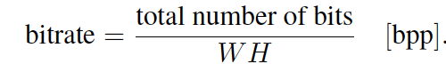

the number of pixels W H of the image

- **PSNR**

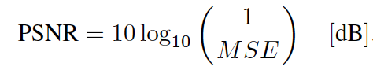

### **Baseline**

- Traditional codecs : JPEG, JPEG2000, BPG
- INR-based : COIN (1)

(1) Emilien Dupont, Adam Golinski, Milad Alizadeh, Yee Whye Teh, and Arnaud Doucet. COIN: COmpression with implicit neural representations. Neural Compression: From Information
Theory to Applications – Workshop (ICLR), 2021.

[https://github.com/EmilienDupont/coin](https://github.com/EmilienDupont/coin)

- RDAE-based : Balle’ (2), Xie (3)

(2) : Johannes Ball e, Valero Laparra, and Eero P Simoncelli. End to end optimized image compression. International Conference on Learning Representations (ICLR), 2017.

(3) : Yueqi Xie, Ka Leong Cheng, and Qifeng Chen. Enhanced invertible encoding for learned image compression. ACM International Conference on Multimedia, 2021.

[https://github.com/xyq7/InvCompress](https://github.com/xyq7/InvCompress)

### Optimization and Hyperparameters

- use INRs with 3 hidden layers
- sine activations combined with the positional encoding using $\sigma$(scaling parameter)= 1.4
- Kodak dataset (higher resolution) → set the number of frequencies L = 16
- CelebA → L=12
- M : the number of hidden units per layer,
    - the width of the MLP → to evaluate performance at different rate-distortion operating points
    - CelebA : M $\in$ {24,32,48,64} 
    - Kodak : M $\in$ {32,48,64,128} 
- optimal bitwidth
    - basic : b=8
    - meta-learned : b=7

### 1. Comparison with State-of-the-Art

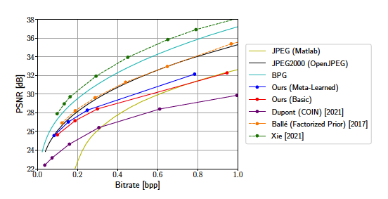

Kodak dataset

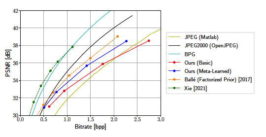

CelebA dataset

전체 비트 범위에서 basic 방법만으로도 이미 COIN 보다 좋은 성능을 보임

CelebA의 높은 비트 범위대를 제외하고는 대부분 JPEG보다도 좋은 성능을 보임

meta-learned 가 basic보다 결과가 좋음

두 데이터셋을 비교했을때, 차이가 눈에 띄게 나는 것은 CelebA 데이터셋임

- 낮은 비트에서는 meta-learned가 JPEG2000 성능에 도달하나 높아질수록 도달하지 못함
- 낮은 비트에서는 meta-learned가 autoencoder(factorized prior)에 거의 도달함

높은 비트에서 확실히 autoencoder의 장점이 명확히 나타남.

SOTA RDAE만큼 BPG도 두 데이터셋 모두에서 좋은 성능을 보임

### 2. Visual Comparison to JPEG and JPEG2000


meta-learned vs. JPEG vs. JPEG2000 (Kodak)

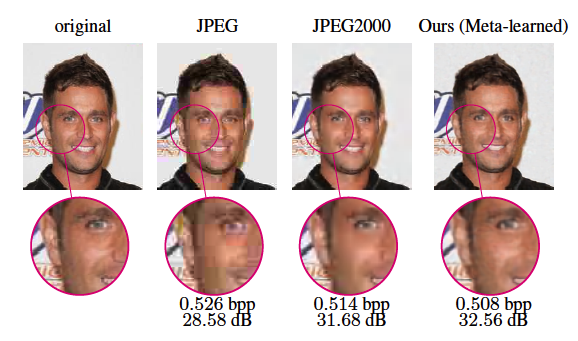

meta-learned vs. JPEG vs. JPEG2000 (CelebA)

바로 보았을 때 JPEG보다는 결과가 상당히 좋다는 것을 확인할 수 있음

둘 다 JPEG, JPEG2000보다 작은 비트 레이트임에도 디테일적으로 화질이 괜찮고, artifact(잡음)이 감소함

특히 kodak 결과에서는 같은 distortion결과에 meta-learned가 더 작은 비트레이트에서 도달했음

시각적으로 JPEG2000이 edge 부분과 높은 frequency 영역에서 artifact 잡음이 많이보였음

그렇지만, 하늘부분은 JPEG2000에서 더 잘 렌더링되었음 → our model introduces periodic artifacts

CelebA 데이터셋에서는 JPEG2000에 비해 비트레이트는 더 적게, PSNR은 더 높은 결과를 보임 (더 적은 비트에서 좋은 화질의 결과를 얻을 수 있었다.)

JPEG2000이 edge 부분에서 artifact가 보임(배경의 글자 부분)

얼굴 영역에서 밝은 부분에서 어두운 부분으로 더 smooth → more natural tonal transition (자연스럽게 톤이 변화됨)

### 3. Convergence Speed


In the beginning of the overfitting

overfitting이 시작될 때에는 meta-learned가 가장 빨리 수렴되었음.

meta의 첫번째 3epoch는 basic의 50epoch보다 좋은 결과

각 모델의 최종 성능에 가까워질수록 수렴속도가 느려지지만 meta-learned 방식은 이점을 유지

: It achieves the same performance after 2500(meta-learned) epochs as the basic approach after 25000(basic) epochs → 학습  속도를 90% 단축해서, 빠르게 할 수 있음

### 4. Number of Layers and Hidden Dimension

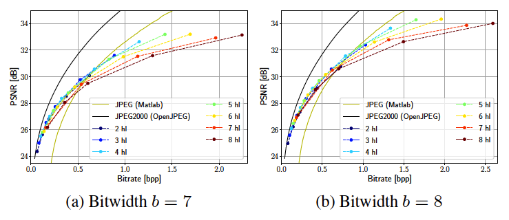

*hl = hidden layer

MLP의 depth, width 둘 다 직접적으로 파라미터 수에, 간접적으로 bitrate에 영향을 준다.

→ network를 scaling up하는 방법이 2가지 있음 

hidden unit과 hidden layers의 조합을 위해 rate-distortion performance를 측정

bitrate는 게속 증가하지만 PSNR 증가는 작은 폭이다.

더 많은 수의 hidden layer에 대한 flatting은 낮은 bidtwidth b=7에서 pronounced(확연하게 나타나게)된다. 

quantization noise는 더 심해지고 depth가 깊어질수록 noise는 증폭되어지고 performance를 제한한다.

rate-distortion performance scale은 model의 width와 더 많은 관련이 있다고 결론을 내렸다.

### 5. Choosing Input Encoding and Activation

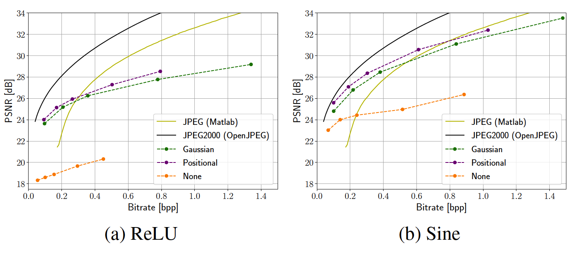

[Positional Encoding](https://www.notion.so/Positional-Encoding-ad46de11a7974e36a5e43f7892886d4d)

Gaussian encoding Model이랑 비교


hidden dimension과 같은 숫자의 frequency를 사용

random initialization(regularization parameter )부터 시작해서 Kodak dataset에 hidden dimension($M \in$ {32,48,64,96, 128})이랑 input encoding을 다르게 해서 training 을 시킴. 

높은 bitrate에서 sine이 ReLU를 넘어서는 것을 볼 수 있다. 

Best input encoding은 두 activation에서 모두 Gaussian을 넘어서는 positional encoding이다.

SIREN 구조에서 ReLU보다 좋았지만 input encoding을 사용하는 모델의 성능에는 미치지 못했다.

### 6. Impact of L1 Regularization

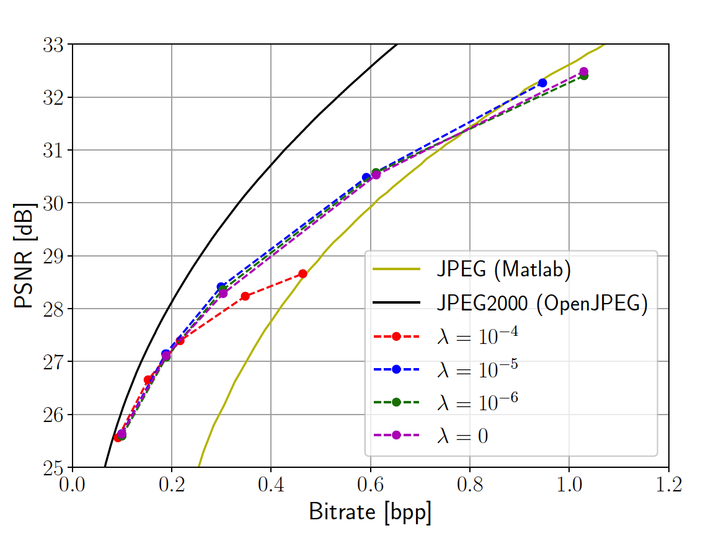

L1 Regularization → 엔트로피 감소를 도와주지만 적절한 rate-distortion trade off을 위해서는 architecture의 size를 수정해야하는 문제랑 같이 생각해야한다.

### 7. Post-Quantization Optimization

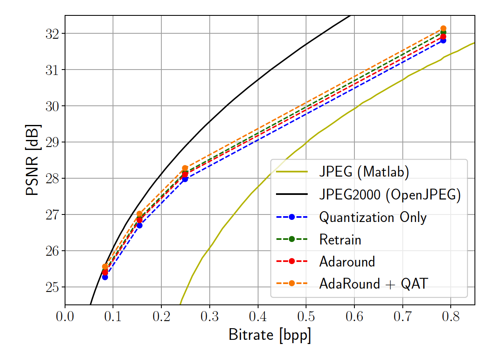

AdaRound 와 retraining이 도입되면서 성능이 더 나아짐

bitrate range 전체에서 가장 좋은 방법은 method들을 결합해서 함께 적용시키는 것이다.

# Conclusion

- Performance gains can be particularly attributed to a careful ablation of the INR architecture and the introduction of meta-learned initializations.
    
    (the first that allows INRs to be competitive with traditional codecs over a large portion of bitrates)
    
- meta-learning approach
- observed a reduction in bitrate at the same reconstruction quality
- use a lower quantization bitwidth while maintaining a similar PSNR
    - weight updates are more compressible than the full model weights
    - more prominent on the CelebA dataset, where the initializations are trained on an image distribution that is more similar to the test set (less variation than natural scene)
- our compression algorithm adaptive to a certain distribution by including *apriori* knowledge into the initialization
- the introduction of meta-learned initializations to INR-based compression
    - show that our meta-learned approach can reduce training time by up to 90% while achieving the same performance as the basic approach
- highlight the importance of the architecture and input encodings for INR-based compression (ReLU vs. sine)
- `clear limitation → the scaling of INRs to higher bitrates (show less competitive performance at higher bitrates)`

```toc
```