# Information Theory (정보이론)
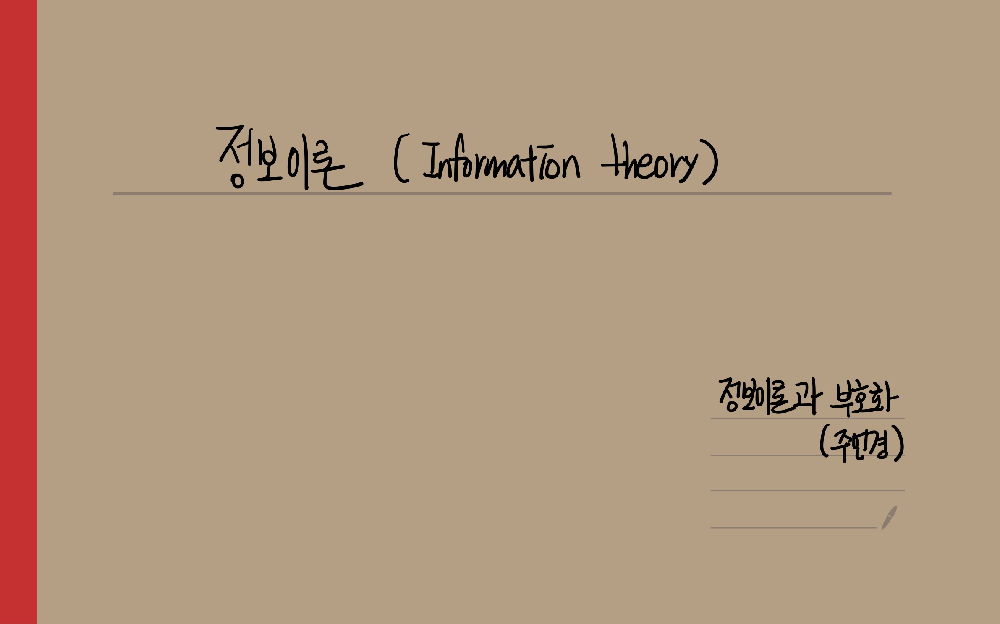
## 정보이론의 용어
- Information : 정보이론에서는 bit로 측정되며 주어진 이벤트에서 발생하는 "surprise"의 양으로 이해할 수 있다. 
(defined as the amount of “surprise” arising from a given event)
- 정보원(Source) : 정보가 발생하는 곳
- code : 수신자가 받을 수 있는 모든 벡터를 의미
- codeword : 부호어, 코드 중에서 generator를 통해 인코딩된 벡터만을 의미
- incoding : 보내고자하는 원래 msg(message) symbols에 식별자(parity check symbol)을 더하는 과정 
- symbol : k개의 bit를 하나로 모아놓은 단위
- bit per second (bps):전송되는 bit의 초당 속도
- Entropy : Information의 기대값, 특정한 stochastic process에서 생성된 information의 평균
- channel : 입력과 출력이 있는 하나의 시스템
- capacity : 주어진 channel에서 도달할 수 있는 최대 상호정보량 (upper limit)
- 상호정보량(mutual information) : channel로 입력되는 정보량 중에 실제 channel의 출력까지 전달되는 정보량
- prior probability : 결과가 나타나기 전에 결정되어있는 원인의 확률
- posterior probability : 결과가 발생하였다는 조건하에서 원인이 발생되었을 확률
- SNR (Signal to Noise ratio) ; Noise가 signal에 대한 영향을 정량적으로 나타낸 척도

## 정보이론의 정의와 척도
Claude shannon이 정보의 정량화를 시도하면서 확립된 이론이다.
- 통신의 수학적 이론(A Mathematical Theory of Communication)을 통해 발표
- 정보는 셀 수 없는 추상적인 개념인데 이를 정량화시킬 수 있는 방법에 대해서 고민
- 정보를 확률과정으로서 파악, 정보량을 확률과정론에 도입하여 넓은 의미에서 정의하고, 잡음에 의한 영향을 고려하였으며, 정보량으로서의 엔트로피 등의 새로운 개념을 도입

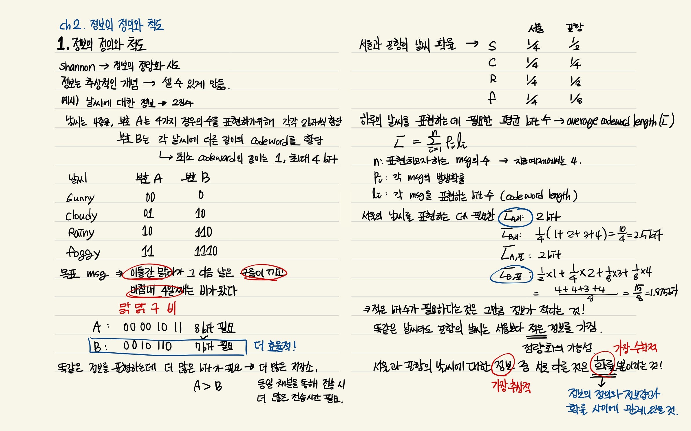
## 정보량의 정의와 Entropy

- Information (정보) : 주어진 이벤트에서 발생하는 "surprise"의 양으로 이해할 수 있다. 

- Information의 수학적 정의
    - 특정한 stochastic event E에 대한 확률의 negative log로 나타낼 수 있으며, 밑이 2인 로그를 사용

        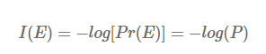

    --> Ex) 어떤 동전이 앞면이 나올 확률이 99%, 뒷면이 나올 확률이 1%일 때, 

    앞면이 나오는 일은 놀랍지 않지만 뒷면이 나오는 일은 놀랍다.

    앞면에 대한 information은 -log2(0.99) = 0.0144bits 로 굉장히 낮으며, 반대로 뒷면에 대한 information은 -log2(0.01) = 6.64bits 로 높은 값을 갖는다. 

    => surprise의 정도가 information에 잘 반영됨을 알 수 있다.
    
- Entropy
    - Information의 기대값, 특정한 stochastic process에서 생성된 information의 평균

    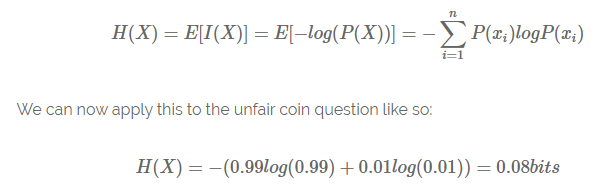

    즉, 위의 예시의 동전은 0.08bits의 평균 정보 전달률을 갖는 stochastic information generator라고 볼 수 있다.

    공평한 동전(앞면 뒷면 각각 0.5)일 때에 대해서 계산을 해보면 -(0.5 x -1 + 0.5 x -1) = 1bit가 나온다. 

    `불공평한 동전은 결과값을 예측하기 굉장히 쉬워서 Entropy 값이 낮게 나왔고, 공평한 동전은 결과값을 예측하는 게 굉장히 어렵기 때문에 Entropy 값이 높게 나왔다고 해석할 수 있다. `


# Shannon's 1st theorem (Source coding Theory) 
1️⃣ 한 줄 요약 : 아무리 좋은 코드를 설계하더라도 평균 길이가 엔트로피 H(X)보다 짧아질 수 없다
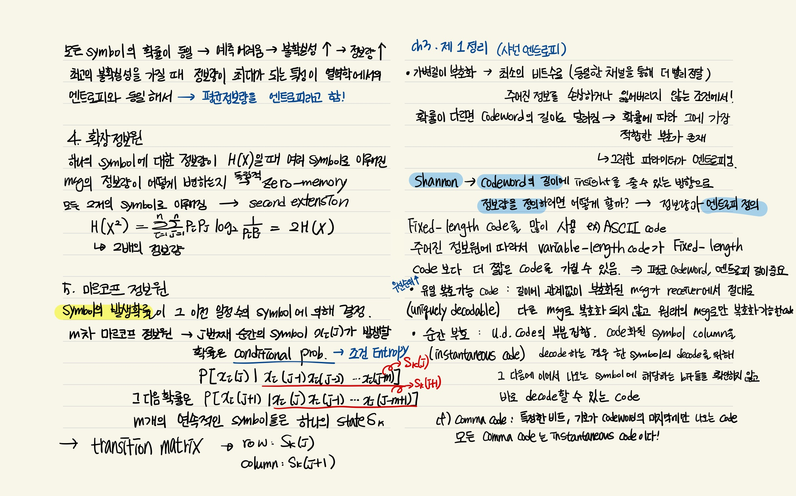
## Prefix Rule
주어진 code가 instantaneous code(순간 코드)인지 아닌지를 확인할 수 있는 방법이다. code 중에 있는 어느 code여도 다른 code의 앞부분에 위치하는 Prefix가 되지 않으면 그 code가  instantaneous이다.

어떤 source의 평균 codeword length는 해당 source의 Entropy가 lower limit이라는 내용의 증명

⭐ 여전히 추상적인 parameter인 정보량, 즉 Entropy를 source coding 에서 가장 필요한 실제적인 parameter인 평균 codeword length의 low limit이 되도록 완벽하게 정의했다는 점!!
- 정보량은 확률에 반비례하는 특성을 가지고 있다는 사실에 근거하여 정보량을 확률의 역수에 대수를 취하여 정의 -> codeword의 length와 관계를 완벽하게 이어줄 수 있었음
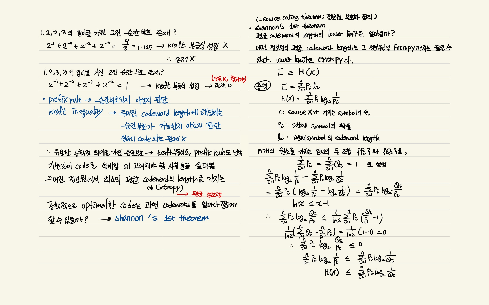
## Channel을 통한 정보 전송
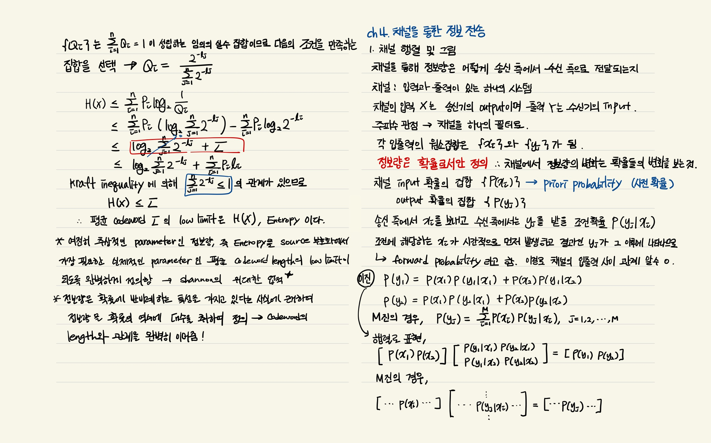
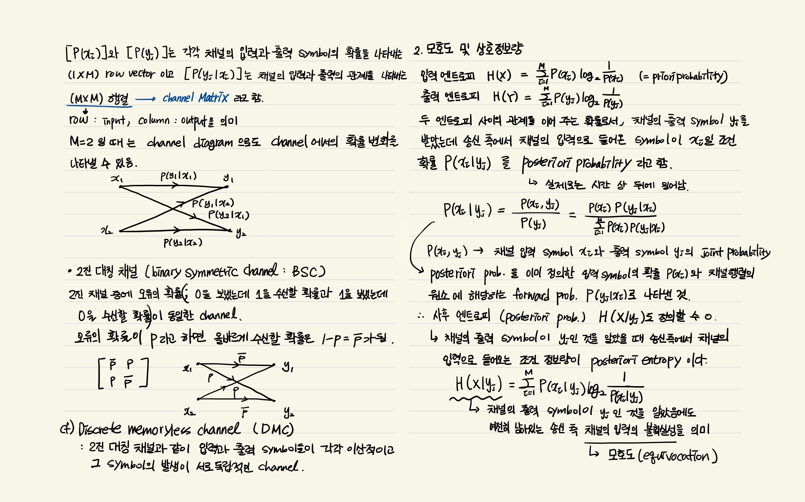
## Shannon's 2nd theorem (Channel Coding Theorem)
- 상호정보량(mutual information, I(X;Y)) : 채널로 입력되는 정보량 중에 실제 채널의 출력까지 전달되는 정보량 

     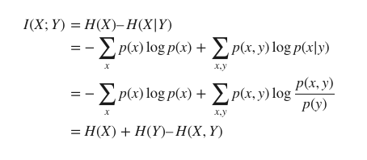


     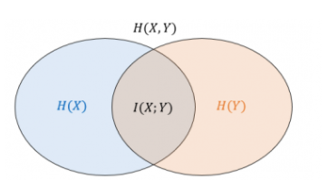
    
    상호정보량는 X에 대한 불확실한 정도인 엔트로피 H(X)에서 Y가 주어진 경우 X에 대한 불확실한 정도 H(X|Y)를 뺀 정보량에 해당

1️⃣  한 줄 요약 : 주어진 channel에서 상호정보량을 최대화할 수 있는 방법

- 송신자가 보낸 코드 X가 수신자에게 Y라는 코드로 전달되는 통신에서 채널을 통한 실제 통신과정에서는 정보의 손실과 왜곡이 불가피하게 일어난다. 
- 채널에서 일어나는 정보전달의 불완전성은 송·수신 코드 사이의 확률적 관계 p(y|x)로 표현
- shannon은 불완전한 채널의 정보전달 용량은 상호정보량으로 수치화할 수 있음을 보였다.
                
    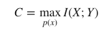

    > - 채널용량은 코드의 사용 빈도수 p(x)를 조정하면서 X와 Y사이에서 얻을 수 있는 최대 상호정보량으로 정의
    > - 채널용량이 C=0인 채널은 어떤 정보도 전달하지 못하고, C=1인 채널은 1 비트에 해당하는 정보를 전달

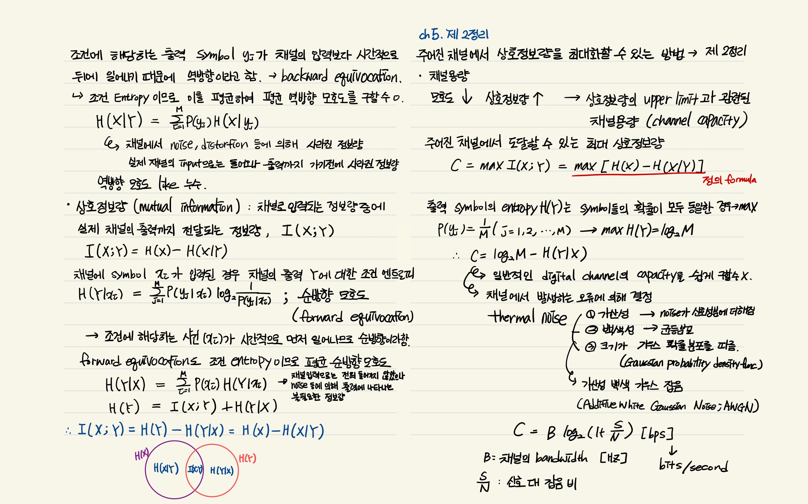
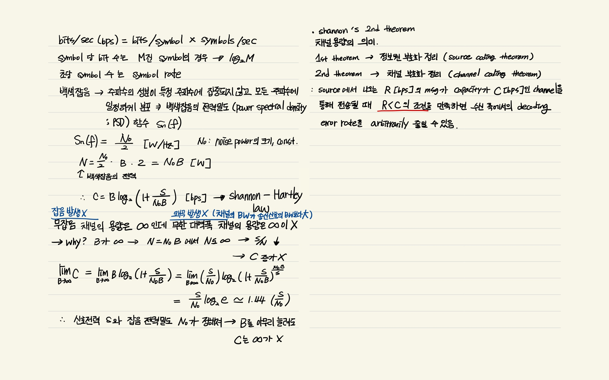
### Rate distortion theory
- 코드 X를 바로 전송하지 않고 압축된 코드 Z로 변환해서 전송하는 소스코딩과 관련된 이론
- d(x,z) : 특정 코드 x와 압축코드 z 사이의 왜곡 정도를 나타내는 거리 함수
- 정보의 평균 왜곡 $∑_{x,z}p(x,z)d(x,z)= D$를 허락하는 X와 Z 사이의 왜곡 비트율 역시 상호정보량으로 표현할 수 있음 

    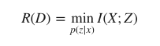

    - D 만큼의 평균 왜곡을 허락하는 조건 아래에서, X→Z의 변환 p(z|x)를 조정해서 X와 Z 사이의 상호정보량을 최대한 줄이는 최적화이다.

        → 이렇게 하면 $2^R$개 만큼의 구별되는 메시지를 압축코드 Z를 통해서 표현

    - 왜곡이 전혀 없는 D=0인 경우,
    
        Z로부터 X를 완전히 복원할 수 있어서 불확실한 정도 H(X|Z)=0 → 왜곡 비트율과 섀넌의 엔트로피는 R(D=0)=H(X)–H(X|Z)=H(X)로 같다

    => H(X) 가 왜곡이 없는 조건에서 코드 X의 정보량을 수치화했다면, 왜곡 비트율 이론은 왜곡을 허락하는 일반적인 조건에서 X가 압축된 코드 Z를 통해서 가지게 되는 정보량을 수치화

## 중복성
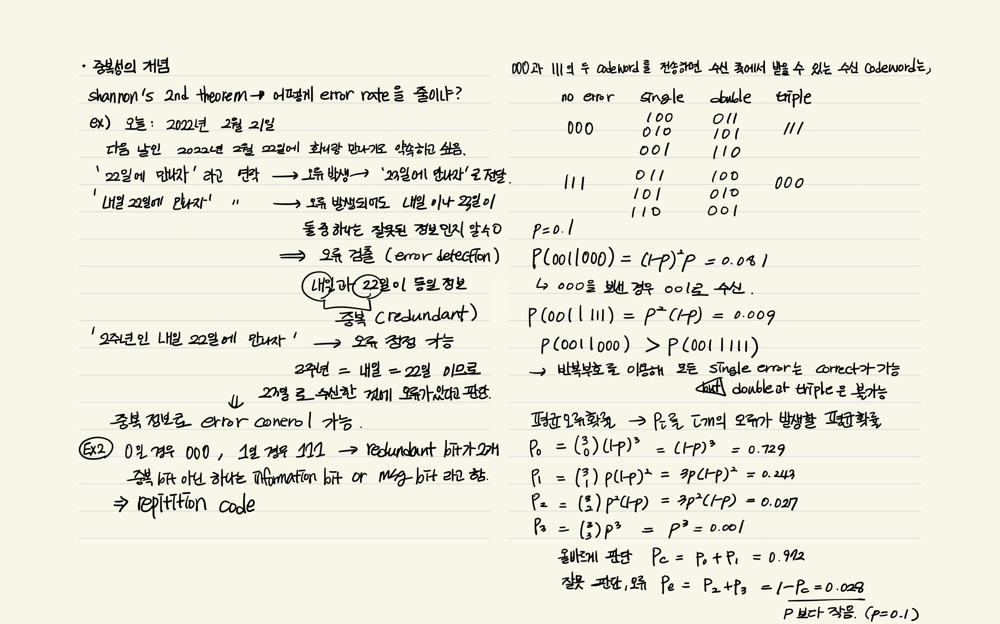
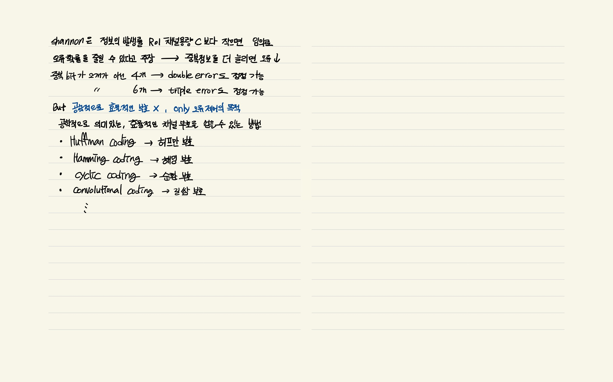

## reference 
- 주언경, <정보이론과 부호화>
- [link 1](https://adventuresinmachinelearning.com/cross-entropy-kl-divergence/)
- [link 2](https://hoya012.github.io/blog/cross_entropy_vs_kl_divergence/)
- [coding theory](https://blog.naver.com/ptm0228/221788016714)

 ```toc
```